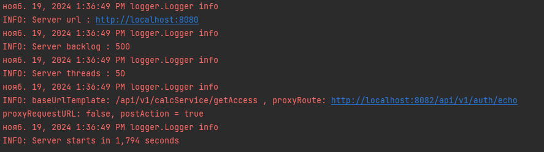
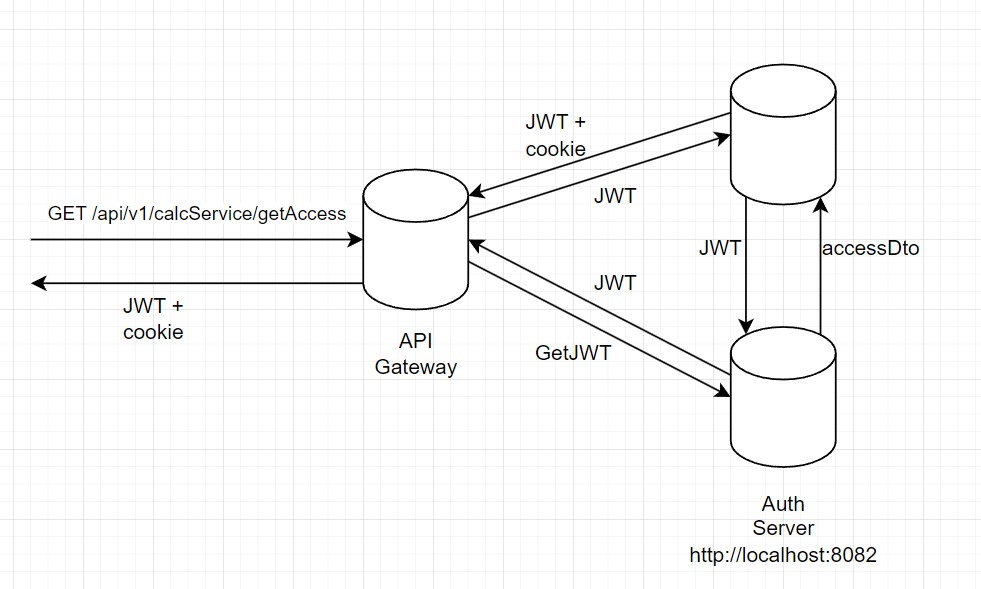
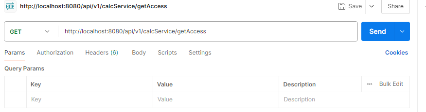
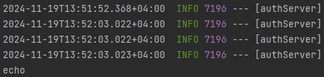
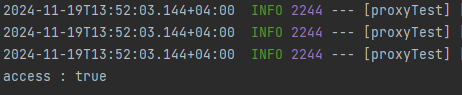
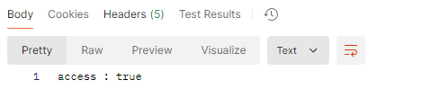

# Проект API_GATEWAY
Основная задача проекта - реализация простого конфигуриемого 
сервера по паттерну API GATEWAY. Основная функциальность сервера:
1. Проксирование запросов

Сервер является конфигуриемым и позволяет настроить:
1. Пути проксирования
2. Действие после получения ответа от проксируемого сервера 
3. Балансировку для проксированных запросов (в разработке)

# Примеры работы
1. Логирование конфигурации при запуске

2. Пример конфигурации сервера через код:
```java

public class Main {
    public static void main(String[] args) {
        IConfigLoader iConfigLoader = () -> ServerConfig.builder()
                .threadsCount(50)
                .backlog(500)
                .host("localhost")
                .port(8080)
                .build();
        IGatewayConfigLoader iGatewayConfigLoader = () ->
                RoutingConfig.builder().addRoute("/api/v1/calcService/getAccess", "http://localhost:8082/api/v1/auth/echo", (o) -> {
                    try {
                        HttpURLConnection connection = (HttpURLConnection) new URL("http://localhost:8081/api/v1/calcService/getAccess").openConnection();
                        connection.setRequestMethod("GET");
                        connection.connect();
                        connection.getResponseCode();
                        ProxyHandlerUtil.copyResponseHeaders(connection, o.getThisServerExchange());
                        o.getThisServerExchange().sendResponseHeaders(connection.getResponseCode(), connection.getContentLengthLong());
                        ProxyHandlerUtil.copyResponseBody(connection, o.getThisServerExchange());
                        o.getThisServerExchange().close();
                    } catch (IOException e) {
                        throw new RuntimeException(e);
                    }
                },false);
        ApiGatewayServer apiGatewayServer = new ApiGatewayServer(iConfigLoader, iGatewayConfigLoader);
        apiGatewayServer.start();
    }
}
```
3. Схема проксирования аутентификации

4. Реализация действий после проксирования
Отправляем исходный запрос

Запрос летит на auth Server по адресу http://localhost:8082/api/v1/auth/echo


После ответа выполяется postAction
```java
try {
        HttpURLConnection connection = (HttpURLConnection) new URL("http://localhost:8081/api/v1/calcService/getAccess").openConnection();
        connection.setRequestMethod("GET");
        connection.connect();
        connection.getResponseCode();
        ProxyHandlerUtil.copyResponseHeaders(connection, o.getThisServerExchange());
        o.getThisServerExchange().sendResponseHeaders(connection.getResponseCode(), connection.getContentLengthLong());
        ProxyHandlerUtil.copyResponseBody(connection, o.getThisServerExchange());
        o.getThisServerExchange().close();
} catch (IOException e) {
    throw new RuntimeException(e);
}      
```

Отправляется запрос в calcService по адресу http://localhost:8081/api/v1/calcService/getAccess


После получения ответа отдаём пользователю ответ от сервиса с изначального запроса
